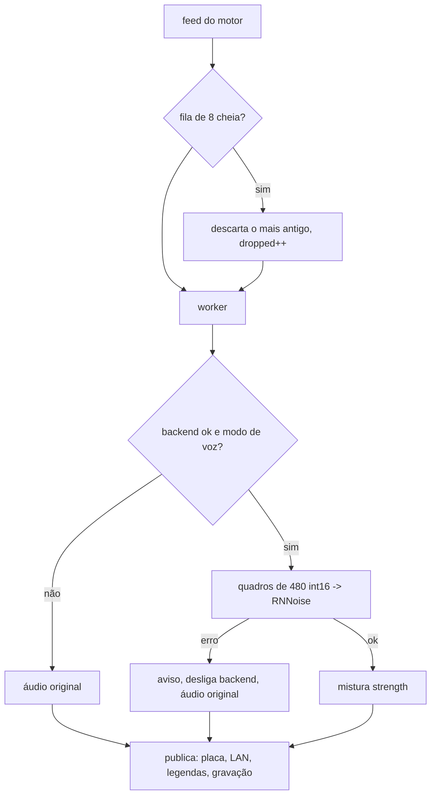
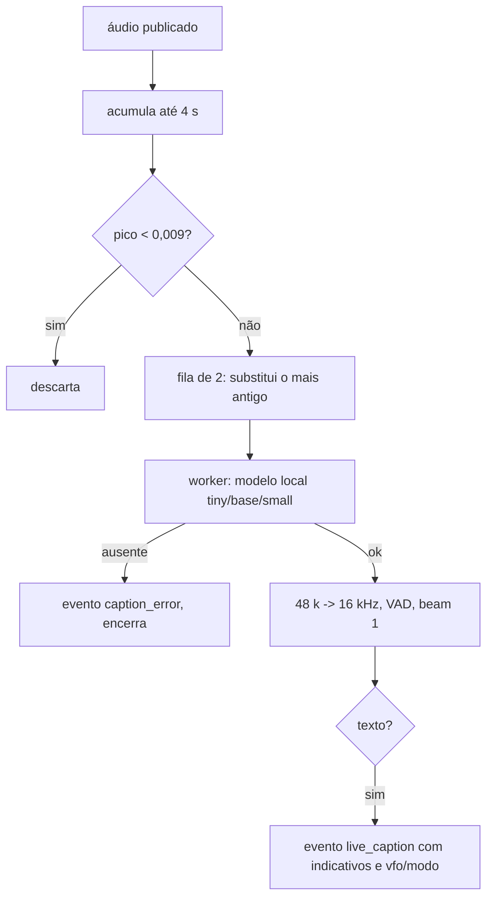

# Fluxogramas — `ai_audio`

> Arqueólogo (Reversa), 2026-11-27. 🟢 extraído de `pt2vhf/neural_audio.py`, `live_caption.py`.

## RNNoise

```mermaid
flowchart TD
    A[feed do motor] --> B{fila de 8 cheia?}
    B -- sim --> B1[descarta o mais antigo, dropped++]
    B --> C[worker]
    B1 --> C
    C --> D{backend ok e modo de voz?}
    D -- não --> E[áudio original]
    D -- sim --> F[quadros de 480 int16 -> RNNoise]
    F -- erro --> G[aviso, desliga backend, áudio original]
    F -- ok --> H[mistura strength]
    E & G & H --> OUT[publica: placa, LAN, legendas, gravação]
```

## Legendas ao vivo

```mermaid
flowchart TD
    A[áudio publicado] --> B[acumula até 4 s]
    B --> C{pico < 0,009?}
    C -- sim --> X[descarta]
    C -- não --> D[fila de 2: substitui o mais antigo]
    D --> E[worker: modelo local tiny/base/small]
    E -- ausente --> F[evento caption_error, encerra]
    E -- ok --> G[48 k -> 16 kHz, VAD, beam 1]
    G --> H{texto?}
    H -- sim --> I[evento live_caption com indicativos e vfo/modo]
```
