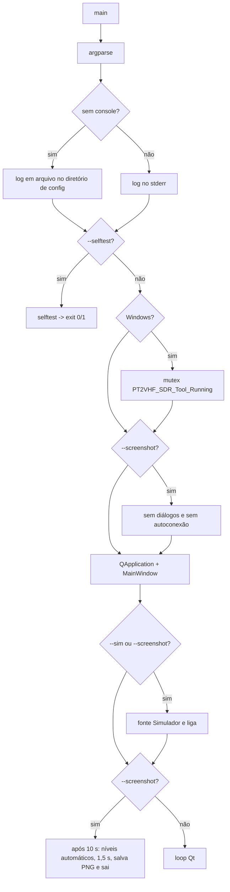
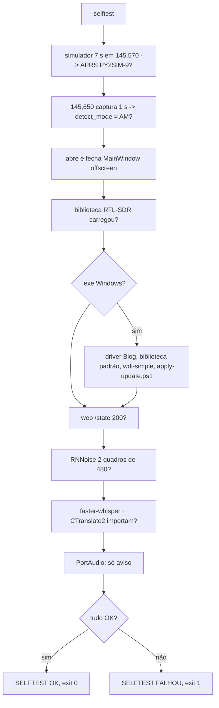

# Fluxogramas — `app`

> Arqueólogo (Reversa), 2026-11-27. 🟢 extraído de `pt2vhf/app.py`.

## Inicialização

```mermaid
flowchart TD
    A[main] --> B[argparse]
    B --> C{sem console?}
    C -- sim --> C1[log em arquivo no diretório de config]
    C -- não --> C2[log no stderr]
    C1 & C2 --> D{--selftest?}
    D -- sim --> S[selftest -> exit 0/1]
    D -- não --> E{Windows?}
    E -- sim --> E1[mutex PT2VHF_SDR_Tool_Running]
    E --> F{--screenshot?}
    E1 --> F
    F -- sim --> F1[sem diálogos e sem autoconexão]
    F --> G[QApplication + MainWindow]
    F1 --> G
    G --> H{--sim ou --screenshot?}
    H -- sim --> H1[fonte Simulador e liga]
    H --> I{--screenshot?}
    H1 --> I
    I -- sim --> I1[após 10 s: níveis automáticos, 1,5 s, salva PNG e sai]
    I -- não --> J[loop Qt]
```

## Autoteste

```mermaid
flowchart TD
    A[selftest] --> B[simulador 7 s em 145,570 -> APRS PY2SIM-9?]
    B --> C[145,650 captura 1 s -> detect_mode = AM?]
    C --> D[abre e fecha MainWindow offscreen]
    D --> E[biblioteca RTL-SDR carregou?]
    E --> F{.exe Windows?}
    F -- sim --> F1[driver Blog, biblioteca padrão, wdi-simple, apply-update.ps1]
    F --> G[web /state 200?]
    F1 --> G
    G --> H[RNNoise 2 quadros de 480?]
    H --> I[faster-whisper + CTranslate2 importam?]
    I --> J[PortAudio: só aviso]
    J --> K{tudo OK?}
    K -- sim --> OK[SELFTEST OK, exit 0]
    K -- não --> NO[SELFTEST FALHOU, exit 1]
```
