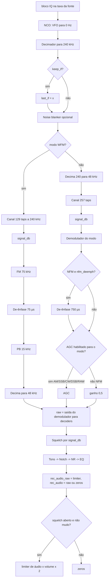
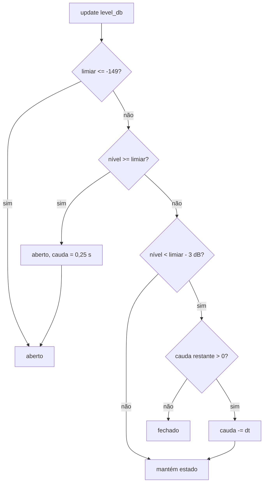
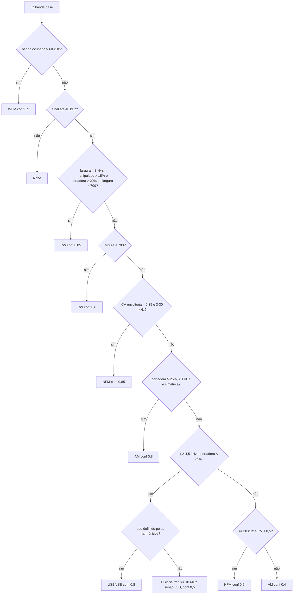

# Fluxogramas — `dsp`

> Arqueólogo (Reversa), 2026-11-27. 🟢 extraído de `pt2vhf/dsp/`.

## `Receiver.process(iq)`

```mermaid
flowchart TD
    IQ[bloco IQ na taxa da fonte] --> NCO[NCO: VFO para 0 Hz]
    NCO --> S1[Decimador para 240 kHz]
    S1 --> KI{keep_if?}
    KI -- sim --> LI[last_if = x] --> NB
    KI -- não --> NB[Noise blanker opcional]
    NB --> M{modo WFM?}
    M -- sim --> W1[Canal 129 taps a 240 kHz] --> W2[signal_db] --> W3[FM 75 kHz] --> W4[De-ênfase 75 µs] --> W5[PB 15 kHz] --> W6[Decima para 48 kHz] --> RAW
    M -- não --> N1[Decima 240 para 48 kHz] --> N2[Canal 257 taps] --> N3[signal_db] --> N4[Demodulador do modo]
    N4 --> N5{NFM e nfm_deemph?}
    N5 -- sim --> N6[De-ênfase 750 µs] --> N7
    N5 -- não --> N7{AGC habilitado para o modo?}
    N7 -- sim AM/SSB/CW/DSB/RAW --> N8[AGC] --> RAW
    N7 -- não NFM --> N9[ganho 0,5] --> RAW
    RAW[raw = saída do demodulador para decoders] --> SQ[Squelch por signal_db]
    SQ --> FX[Tons -> Notch -> NR -> EQ]
    FX --> REC[rec_audio_raw = limiter, rec_audio = raw ou zeros]
    REC --> O{squelch aberto e não mudo?}
    O -- sim --> OUT[limiter de áudio x volume x 2]
    O -- não --> Z[zeros]
```

## Squelch

```mermaid
flowchart TD
    A[update level_db] --> B{limiar <= -149?}
    B -- sim --> OPEN[aberto]
    B -- não --> C{nível >= limiar?}
    C -- sim --> C1[aberto, cauda = 0,25 s] --> OPEN
    C -- não --> D{nível < limiar - 3 dB?}
    D -- não --> KEEP[mantém estado]
    D -- sim --> E{cauda restante > 0?}
    E -- sim --> E1[cauda -= dt] --> KEEP
    E -- não --> CLOSED[fechado]
```

## `detect_mode` (assistente)

```mermaid
flowchart TD
    A[IQ banda base] --> B{banda ocupada > 60 kHz?}
    B -- sim --> WFM[WFM conf 0,9]
    B -- não --> C{sinal até 40 kHz?}
    C -- não --> NONE[None]
    C -- sim --> D{largura < 3 kHz, manipulado > 15% e portadora > 20% ou largura < 700?}
    D -- sim --> CW1[CW conf 0,85]
    D -- não --> E{largura < 700?}
    E -- sim --> CW2[CW conf 0,6]
    E -- não --> F{CV envoltória < 0,35 e 3-30 kHz?}
    F -- sim --> NFM1[NFM conf 0,85]
    F -- não --> G{portadora > 25%, > 1 kHz e simétrica?}
    G -- sim --> AM1[AM conf 0,8]
    G -- não --> H{1,2-4,5 kHz e portadora < 25%?}
    H -- sim --> I{lado definido pelos harmônicos?}
    I -- sim --> SSB1[USB/LSB conf 0,8]
    I -- não --> SSB2[USB se freq >= 10 MHz senão LSB, conf 0,5]
    H -- não --> J{<= 30 kHz e CV < 0,5?}
    J -- sim --> NFM2[NFM conf 0,5]
    J -- não --> AM2[AM conf 0,4]
```
