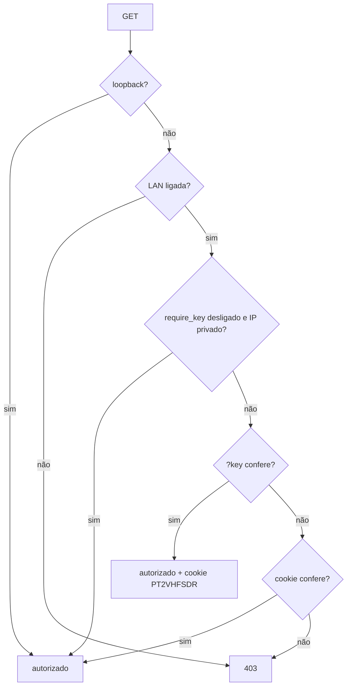
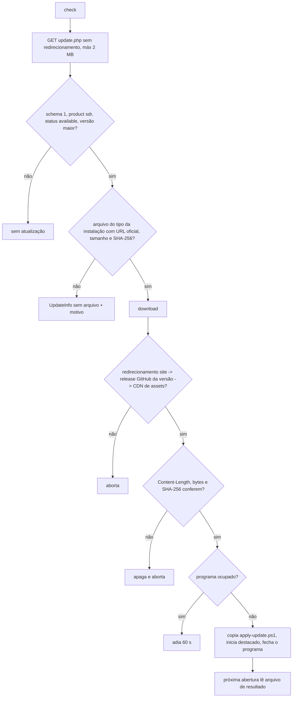

# Fluxogramas — `integrations`

> Arqueólogo (Reversa), 2026-11-27. 🟢 extraído de `pt2vhf/webserver.py`, `updater.py`, `rigctl.py`.

## Autorização do servidor web

```mermaid
flowchart TD
    A[GET] --> B{loopback?}
    B -- sim --> OK[autorizado]
    B -- não --> C{LAN ligada?}
    C -- não --> NO[403]
    C -- sim --> D{require_key desligado e IP privado?}
    D -- sim --> OK
    D -- não --> E{?key confere?}
    E -- sim --> OK2[autorizado + cookie PT2VHFSDR]
    E -- não --> F{cookie confere?}
    F -- sim --> OK
    F -- não --> NO
```

## Atualização OTA

```mermaid
flowchart TD
    A[check] --> B[GET update.php sem redirecionamento, máx 2 MB]
    B --> C{schema 1, product sdr, status available, versão maior?}
    C -- não --> N[sem atualização]
    C -- sim --> D{arquivo do tipo da instalação com URL oficial, tamanho e SHA-256?}
    D -- não --> N2[UpdateInfo sem arquivo + motivo]
    D -- sim --> E[download]
    E --> F{redirecionamento site -> release GitHub da versão -> CDN de assets?}
    F -- não --> X[aborta]
    F -- sim --> G{Content-Length, bytes e SHA-256 conferem?}
    G -- não --> X2[apaga e aborta]
    G -- sim --> H{programa ocupado?}
    H -- sim --> H1[adia 60 s]
    H -- não --> I[copia apply-update.ps1, inicia destacado, fecha o programa]
    I --> J[próxima abertura lê arquivo de resultado]
```
