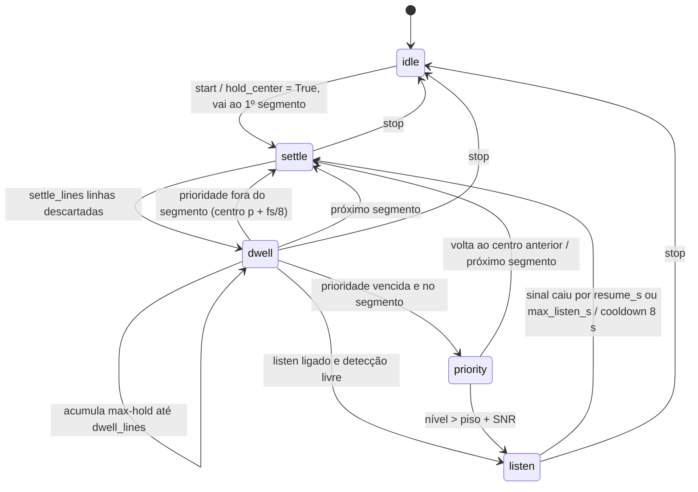
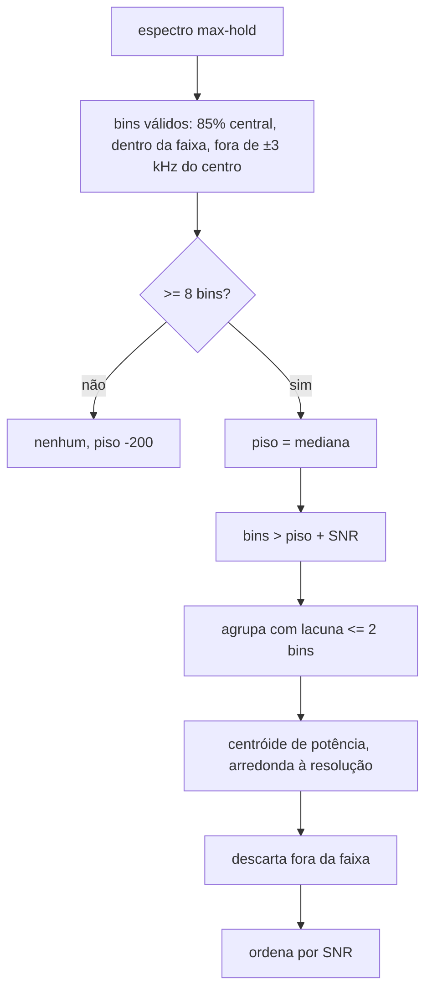

# Fluxogramas — `scanner`

> Arqueólogo (Reversa), 2026-11-27. 🟢 extraído de `pt2vhf/scanner.py`.

## Máquina de estados do `SpectrumScanner`

```mermaid
stateDiagram-v2
    [*] --> idle
    idle --> settle: start / hold_center = True, vai ao 1º segmento
    settle --> dwell: settle_lines linhas descartadas
    dwell --> dwell: acumula max-hold até dwell_lines
    dwell --> priority: prioridade vencida e no segmento
    dwell --> settle: prioridade fora do segmento (centro p + fs/8)
    dwell --> listen: listen ligado e detecção livre
    dwell --> settle: próximo segmento
    priority --> listen: nível > piso + SNR
    priority --> settle: volta ao centro anterior / próximo segmento
    listen --> settle: sinal caiu por resume_s ou max_listen_s / cooldown 8 s
    settle --> idle: stop
    dwell --> idle: stop
    listen --> idle: stop
```

## `detect_signals`

```mermaid
flowchart TD
    A[espectro max-hold] --> B[bins válidos: 85% central, dentro da faixa, fora de ±3 kHz do centro]
    B --> C{>= 8 bins?}
    C -- não --> Z[nenhum, piso -200]
    C -- sim --> D[piso = mediana]
    D --> E[bins > piso + SNR]
    E --> F[agrupa com lacuna <= 2 bins]
    F --> G[centróide de potência, arredonda à resolução]
    G --> H[descarta fora da faixa]
    H --> I[ordena por SNR]
```
