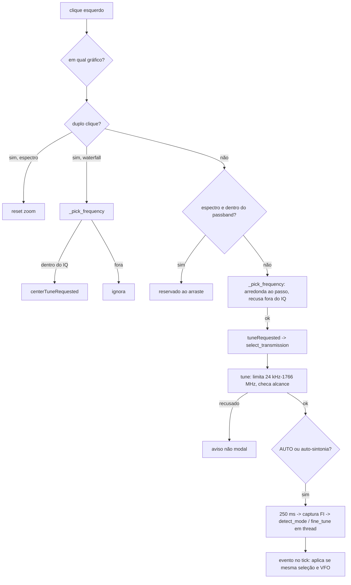
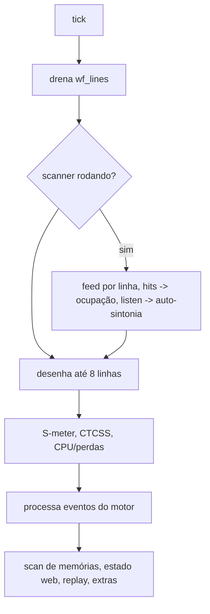

# Fluxogramas — `ui`

> Arqueólogo (Reversa), 2026-11-27. 🟢 extraído de `pt2vhf/ui/main_window.py`, `waterfall.py`.

## Clique no waterfall até sintonia

```mermaid
flowchart TD
    A[clique esquerdo] --> B{em qual gráfico?}
    B --> C{duplo clique?}
    C -- sim, espectro --> Z[reset zoom]
    C -- sim, waterfall --> D[_pick_frequency]
    D -- dentro do IQ --> D1[centerTuneRequested]
    D -- fora --> X[ignora]
    C -- não --> E{espectro e dentro do passband?}
    E -- sim --> X2[reservado ao arraste]
    E -- não --> F[_pick_frequency: arredonda ao passo, recusa fora do IQ]
    F -- ok --> G[tuneRequested -> select_transmission]
    G --> H[tune: limita 24 kHz-1766 MHz, checa alcance]
    H -- recusado --> M[aviso não modal]
    H -- ok --> I{AUTO ou auto-sintonia?}
    I -- sim --> J[250 ms -> captura FI -> detect_mode / fine_tune em thread]
    J --> K[evento no tick: aplica se mesma seleção e VFO]
```

## Tick da interface (33 ms)

```mermaid
flowchart TD
    A[tick] --> B[drena wf_lines]
    B --> C{scanner rodando?}
    C -- sim --> C1[feed por linha, hits -> ocupação, listen -> auto-sintonia]
    C --> D[desenha até 8 linhas]
    C1 --> D
    D --> E[S-meter, CTCSS, CPU/perdas]
    E --> F[processa eventos do motor]
    F --> G[scan de memórias, estado web, replay, extras]
```
